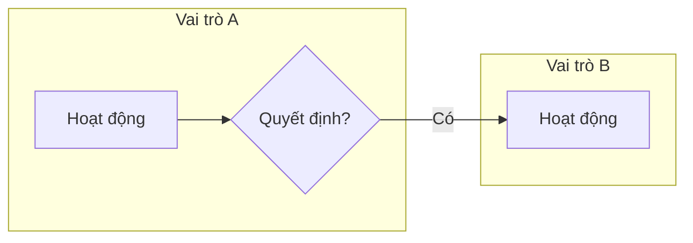

# Khung trống cho bản phân tích và thiết kế

> **Khi nào đọc file này:** người học xin "mẫu", "khung", "nên trình bày thế nào". Đưa **khung trống** (cột, câu hỏi cần trả lời) — không điền nội dung cho doanh nghiệp của nhóm. Thứ tự các khung theo 8 bước trong `quy-trinh-phan-tich.md`. Lộ trình J: khung nộp bài chính thức theo `btl/de-bai-btl.md`; các khung dưới đây chỉ dùng thêm khi hữu ích.

## K1. Hồ sơ doanh nghiệp

| Mục | Nội dung |
|---|---|
| Ngành, sản phẩm / dịch vụ, đặc điểm hàng (hạn dùng, serial, cỡ màu…) | |
| Quy mô (số mặt hàng, khách, nhà cung cấp, chứng từ / tháng) | |
| Kho, cửa hàng, chi nhánh | |
| Khách hàng, chính sách bán (tiền ngay / bán chịu / trả trước) | |
| Nhà cung cấp, cách mua | |
| Giá và chiết khấu | |
| Thu chi (quỹ, ngân hàng) | |
| Vai trò người dùng | |
| **Trong phạm vi / ngoài phạm vi / giả định đơn giản hóa** | |

## K2. Danh sách quy trình (SIPOC rút gọn)

| Quy trình | Sự kiện bắt đầu | Kết thúc | Bên cung cấp đầu vào | Đầu vào | Đầu ra | Bên nhận | Vai trò tham gia |
|---|---|---|---|---|---|---|---|

## K3. Mô tả quy trình

Sơ đồ (swimlane, mỗi lane một vai trò) — có thể viết bằng mermaid:

| STT | Sự kiện kích hoạt | Hoạt động | Vai trò | Giấy tờ vào / ra | Ngoại lệ |
|---|---|---|---|---|---|

Luồng chứng từ: `Chứng từ 1 → (tạo dựa trên) → Chứng từ 2 → …`

## K4. Phân loại dữ liệu và ma trận truy cập

| Thông tin | Loại (dữ liệu chủ / sự kiện / số liệu theo dõi / thiết lập) | Ai tạo | Ai xem | Ai sửa | Ai xóa |
|---|---|---|---|---|---|

## K5. Quy tắc nghiệp vụ

| Mã | Quy tắc | Khi nào áp dụng | Vi phạm thì sao (chặn / cảnh báo) | Kiểm tra ở đâu (form / FillCheckProcessing / Posting) | Lý do |
|---|---|---|---|---|---|

## K6. Câu hỏi quản lý → báo cáo

| Mã | Câu hỏi (cụ thể, kiểm chứng được) | Tại thời điểm hay trong kỳ | Theo các chiều | Ai hỏi, bao lâu một lần | Đáp ứng bởi register / báo cáo |
|---|---|---|---|---|---|

## K7. Bảng thiết kế object

| Object | Loại metadata | Attribute chính | Tabular section | Hierarchy / Owner / Predefined | Dòng nghiệp vụ nào cần nó | Vì sao chọn loại này | Phương án đã loại |
|---|---|---|---|---|---|---|---|

## K8. Thiết kế register

| Register | Loại (Accumulation Balances / Turnovers, Information periodic / không) | Dimension | Resource | Attribute | Trả lời câu hỏi quản lý nào |
|---|---|---|---|---|---|

## K9. Ma trận posting

| Chứng từ | Register | Chiều (tăng / giảm / phát sinh) | Dimension lấy từ | Resource tính thế nào | Điều kiện ghi | Kiểm soát kèm theo |
|---|---|---|---|---|---|---|

## K10. Ma trận phân quyền

| Vai trò (Role) | Object | Xem | Thêm | Sửa | Post | Xóa |
|---|---|---|---|---|---|---|

## K11. Kịch bản kiểm thử và truy vết

| # | Thao tác nhập liệu (theo thứ tự) | Kết quả mong đợi (số dư, báo cáo, thông báo lỗi) | Quy tắc / câu hỏi được kiểm tra | Kết quả thực tế |
|---|---|---|---|---|

Truy vết: mỗi dòng K5 và K6 phải xuất hiện ít nhất một lần trong K11; mỗi object trong K7 phải trả lời được cột "Dòng nghiệp vụ nào cần nó".

## Nhật ký quyết định

| Ngày | Quyết định | Lý do | Phương án đã loại | Ai quyết |
|---|---|---|---|---|
